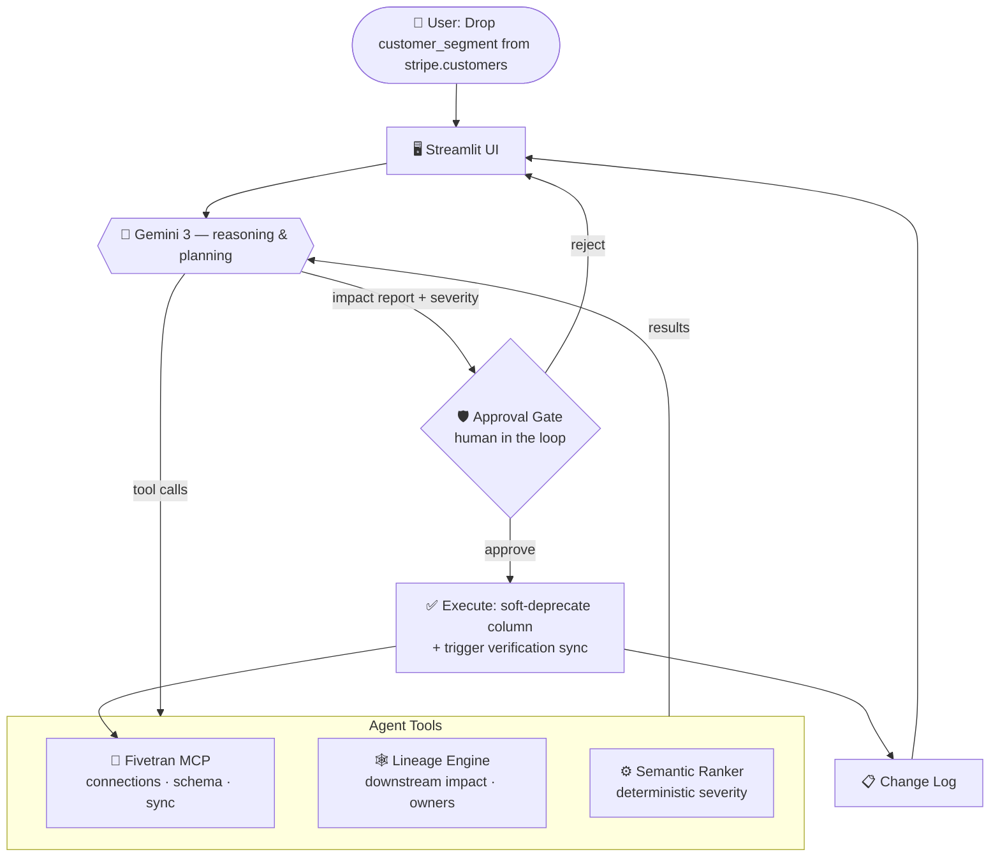

# Atlas 🔍
**Data Change Intelligence Agent**

*Built for the Google Cloud Rapid Agent Hackathon 2026 (Fivetran Track)*

> 🌐 **Live Demo:** [https://atlas-fivetran.streamlit.app/](https://atlas-fivetran.streamlit.app/)

---

## ⚡ The Problem

Data pipelines break constantly because upstream schema changes (like dropping a column or changing a data type) are made without understanding the downstream impact. Data engineers waste hours manually tracing lineage across dbt, Looker, and machine learning platforms, often discovering breakages only *after* executive dashboards fail.

## 🚀 The Solution

**Atlas** is an AI agent powered by **Gemini 3** and **Fivetran's Model Context Protocol (MCP)**. It proactively analyzes the impact of proposed schema changes before they happen. 

Instead of just answering questions, Atlas **takes action**:
1. It validates the current schema state directly via Fivetran.
2. It traces the lineage of the specific column across all downstream assets (dbt, Tableau, Looker, ML features).
3. It determines the business criticality of the change.
4. It formulates a deprecation plan and drafts custom communications for affected stakeholders.
5. **Upon user approval, it uses Fivetran to automatically soft-deprecate the column and triggers a verification sync.**

## 🧠 Architecture & Multi-Step Reasoning

Atlas isn't a chatbot; it's an agentic workflow. When given a complex prompt (e.g., *"Drop `forecast_category` from Salesforce and `lead_source_legacy` from HubSpot"*), Gemini 3's advanced reasoning dynamically parallelizes its tasks:

1. **Verify** connection health and schema status via Fivetran MCP (`salesforce`, `hubspot`).
2. **Retrieve** lineage maps for both targets.
3. **Synthesize** a combined impact report across multiple data domains.
4. **Execute** multiple `modify_connection_column_config` tool calls.
5. **Trigger** multiple `sync_connection` commands to push changes to production.

## 🔌 Fivetran MCP Integration

Atlas talks to Fivetran through a tool layer ([`fivetran_tools.py`](fivetran_tools.py)) that implements the **same tool names and response shapes as the official [`fivetran/fivetran-mcp`](https://github.com/fivetran/fivetran-mcp) server**. It exposes six tools:

| Tool | Real Fivetran endpoint |
| --- | --- |
| `list_connections` | `GET /v1/connections` |
| `get_connection_details` | `GET /v1/connections/{id}` |
| `get_connection_state` | `GET /v1/connections/{id}/state` |
| `get_connection_schema_config` | `GET /v1/connections/{id}/schemas` |
| `modify_connection_column_config` | `PATCH /v1/connections/{id}/schemas/{schema}/tables/{table}/columns/{column}` |
| `sync_connection` | `POST /v1/connections/{id}/sync` |

For the demo these run against a curated in-memory fixture so judges can exercise the full lifecycle without live credentials. Because the interface matches the official MCP server exactly, it's a **drop-in replacement**: point the tool layer at a real Fivetran account (with API credentials) and Atlas operates on production connections unchanged.

## 🛟 Reliability: Smart Model Fallback + Demo Cache

Two layers keep the demo alive even under free-tier API limits:

- **Smart model fallback** ([`gemini_client.py`](gemini_client.py)) — every Gemini call routes through `smart_generate()`, which walks an ordered model chain and transparently falls back on `429` (rate limit), `503` (overload), or `404` (unavailable model). The chain ends with high-quota models (`gemini-1.5-flash`, 1500 RPD) as a safety net.
- **Demo cache** ([`demo_cache.py`](demo_cache.py)) — the three rehearsed scenarios (drop `customer_segment`, drop `lead_source_legacy`, the not-found `discount_code`) have pre-baked reports. If API quota is fully exhausted, Atlas serves the cached analysis and execution **with zero API calls**, so the live demo never fails. The severity badge, PII flag, and stakeholder cards are still rebuilt deterministically from the lineage layer, so a cached run renders identically to a live one.

## 📸 Screenshots

*[Add screenshots here]*

## 🛠️ Built With

* **Gemini 3** - Advanced reasoning, planning, and multi-tool orchestration
* **Fivetran MCP Server** - Direct integration with Fivetran's configuration API
* **Streamlit** - Custom glassmorphic UI with dynamic state management
* **Python** - Core logic and API integration

## 💻 Running Locally

1. Clone the repository
2. Install dependencies: `pip install -r requirements.txt`
3. Add your Gemini API key to a `.env` file: `GEMINI_API_KEY="your-key"`
4. Run the app: `streamlit run app.py`

## 📄 License

This project is licensed under the MIT License - see the [LICENSE](LICENSE) file for details.
